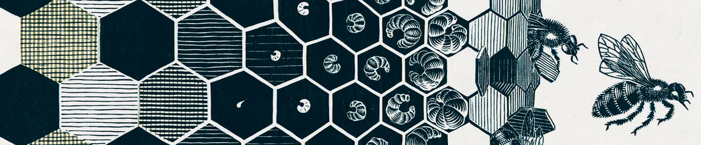

Yo  , I'm Matteo Figini, 
a MSc student in Computer Engineering at Politecnico di Milano and University of Illinois Chicago.

I'm primarly focused in the broad area of **Machine Learning** with a particular interest in the theoretical foundations of the field. 
I also have a background experience in Software Engineering and High Performance Computing.

###### Some tools I use or have experience with:

